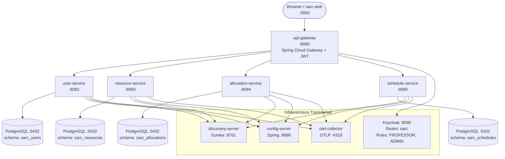
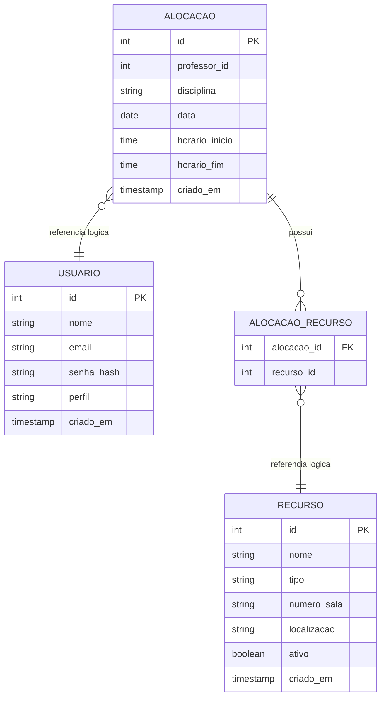

# SARC Arquitetura Projeto

Monorepo base para a revitalizacao do SARC, uma plataforma institucional para consulta e alocacao de salas, laboratorios e recursos computacionais em datas e horarios especificos.

## Arquitetura




## Schemas do Banco

Cada microsserviço possui seu **próprio schema PostgreSQL**, eliminando acoplamento direto de banco entre serviços.

| Schema | Serviço | Tabelas |
|--------|---------|----------|
| `sarc_users` | user-service | `usuario` |
| `sarc_resources` | resource-service | `recurso` |
| `sarc_allocations` | allocation-service | `alocacao`, `alocacao_recurso` |
| `sarc_schedules` | schedule-service | views somente-leitura (`grade_publica`) |

### Diagrama de Entidades



> **Nota:** As referências entre schemas (`professor_id`, `recurso_id`) são **lógicas** — sem FK cross-schema.
> A integridade é garantida pela lógica de negócio do `allocation-service`.

## Modulos

| Módulo | Descrição | Porta |
|--------|-----------|-------|
| `discovery-server` | Eureka Service Registry | 8761 |
| `config-server` | Spring Cloud Config | 8888 |
| `api-gateway` | Gateway de entrada com autenticação JWT | 8080 |
| `user-service` | Gestão de professores e administradores | 8082 |
| `resource-service` | Gestão de salas, labs e equipamentos | 8083 |
| `allocation-service` | Criação e gerenciamento de alocações | 8084 |
| `schedule-service` | Grade pública de horários (somente leitura) | 8085 |
| `sarc-web` | Frontend React | 3000 |
| `config-repo` | Configurações externas dos serviços | — |
| `database` | Scripts SQL do schema relacional | — |

## Execucao Local com Docker

Copie o arquivo de exemplo de variáveis de ambiente:

```bash
cp .env.example .env
```

Suba todos os serviços:

```bash
docker compose up --build
```

Serviços disponíveis após inicialização:

| Serviço | URL |
|---------|-----|
| Frontend | http://localhost:3000 |
| API Gateway | http://localhost:8080 |
| Swagger — user-service | http://localhost:8080/v3/api-docs |
| Keycloak | http://localhost:8090 |
| Eureka | http://localhost:8761 |
| Config Server | http://localhost:8888 |

### Credenciais de teste

| Usuário | E-mail | Senha | Perfil |
|---------|--------|-------|--------|
| Professor Teste | `professor@sarc.local` | `123456` | PROFESSOR |
| Administrador SARC | `admin@sarc.local` | `123456` | ADMIN |

> As credenciais acima são apenas para desenvolvimento local. Em produção, defina variáveis de ambiente em `.env`.

## Variáveis de Ambiente

| Variável | Padrão (dev) | Descrição |
|----------|-------------|-----------|
| `DB_PASSWORD` | `sarc` | Senha do PostgreSQL |
| `DB_HOST` | `postgres` | Host do PostgreSQL |
| `DB_PORT` | `5432` | Porta do PostgreSQL |
| `DB_NAME` | `sarc` | Nome do banco |
| `KEYCLOAK_ADMIN_PASSWORD` | `admin` | Senha do admin do Keycloak |
| `KEYCLOAK_INTERNAL_URL` | `http://keycloak:8080` | URL interna do Keycloak (dentro do Docker) |
| `KEYCLOAK_EXTERNAL_URL` | `http://localhost:8090` | URL externa do Keycloak (acesso do browser) |
| `CORS_ALLOWED_ORIGIN` | `http://localhost:3000` | Origem permitida no CORS |
| `TRACING_PROBABILITY` | `1.0` | Sampling do OpenTelemetry (usar 0.1 em prod) |

## Processo de Desenvolvimento com IA (SDD)

Este projeto foi desenvolvido utilizando **Specification-Driven Development (SDD)** assistido por IA.

### Ferramentas utilizadas

- **Antigravity (Google DeepMind)** com modelo **Claude Sonnet 4.6 (Thinking)**: assistente de codificacao principal, usado para gerar testes unitarios e de integracao, pipelines CI/CD e refatoracoes.
- **Cursor AI**: suporte a navegacao de codebase e contexto de arquivos abertos.

### Estrategia de prompts

1. **Contexto primeiro**: o assistente leu todos os arquivos de dominio (`domain/`, `service/`, `dto/`) antes de gerar qualquer teste, garantindo aderencia aos tipos e contratos reais.
2. **Cenarios em vez de codigo direto**: os prompts descreviam *o que o teste deveria verificar* (ex.: "deve bloquear email duplicado") e o assistente escrevia os metodos correspondentes.
3. **Revisao manual obrigatoria**: todo codigo gerado pela IA foi revisado antes de ser comitado, verificando coerencia com o dominio, ausencia de mocks desnecessarios e legibilidade.
4. **Iteracao por falha**: ao encontrar o erro de compatibilidade Java 25 / Byte Buddy, o assistente diagnosticou a causa-raiz e aplicou a correcao minima no `pom.xml` sem alterar dependencias.

### Cobertura de testes

| Servico | Controller (MockMvc) | Service (Mockito) | Repository (@DataJpaTest) | Total |
|---|---|---|---|---|
| `user-service` | 3 | 8 | 5 | 16 |
| `resource-service` | 4 | 7 | 5 | 16 |
| `allocation-service` | 1 | 6 | 6 | 13 |
| `schedule-service` | 5 | — | — | 5 |

Cobertura mínima configurada: **70% de linhas** via JaCoCo (`mvn verify`).

## Pipelines CI/CD

| Pipeline | Arquivo | Trigger | O que faz |
|---|---|---|---|
| CI — Testes | `.github/workflows/ci.yml` | Push/PR em `main` e `dev` | Compila e testa os 4 servicos, publica JaCoCo, roda OWASP Dependency Check |
| Staging | `.github/workflows/staging.yml` | Push em `main` | Empacota JARs e publica imagens Docker no GHCR com tag `:staging` |
| Produção | `.github/workflows/production.yml` | Tag `v*` | Roda testes, exige aprovação manual, publica `:latest` e `:vX.Y.Z` |

## Troubleshooting

### Serviços não sobem / ficam em restart loop

```bash
# Ver logs de um serviço específico
docker compose logs -f config-server

# Aguardar o config-server estar saudável antes de subir os demais
docker compose up config-server -d
docker compose up
```

### Keycloak não inicializa

O Keycloak pode demorar 30-60s na primeira vez. Aguarde e recarregue.

### Erro de conexão com PostgreSQL

Verifique se as variáveis de ambiente correspondem às do `docker-compose.yml`:

```bash
# Verificar tabelas criadas pelo Flyway em cada schema
docker compose exec postgres psql -U sarc -d sarc -c "\dn"
docker compose exec postgres psql -U sarc -d sarc -c "SET search_path TO sarc_users; \dt"
docker compose exec postgres psql -U sarc -d sarc -c "SET search_path TO sarc_allocations; \dt"
```

### Token JWT inválido (401)

Certifique-se de que o Realm `sarc` foi importado corretamente:

```
Keycloak → http://localhost:8090 → Admin → Realm: sarc → Users
```
